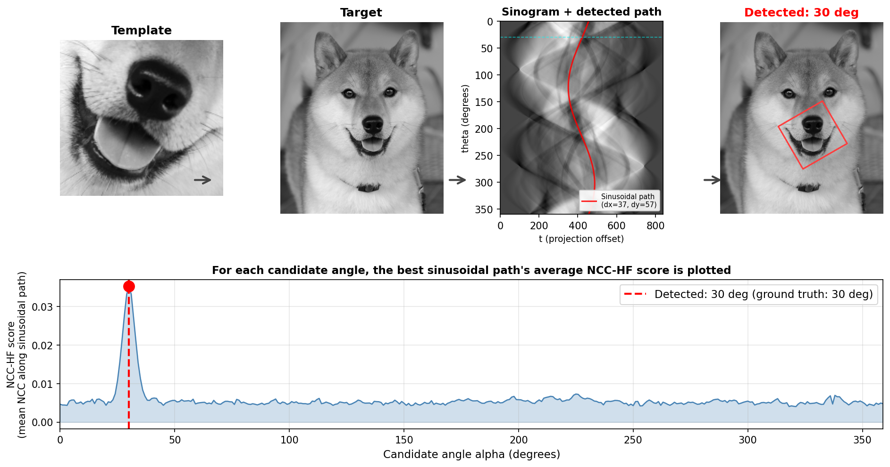

# radon-template-matching

ラドン変換のハフ投票による回転不変テンプレートマッチング

Rotation-invariant template matching using Hough voting on Radon sinograms



## Algorithm / アルゴリズム

A point at (dx, dy) in the image traces a sinusoid `offset(θ) = dx·cos(θ) + dy·sin(θ)` in the Radon sinogram. Exploiting this geometric property, we extract the core (content-only projection) of each template sinogram row, match it against image sinogram rows via 1D sliding NCC, and apply Hough voting on the rotation angle from each match.

画像上の1点 (dx, dy) はラドン変換のサイノグラム上で正弦波 `offset(θ) = dx·cos(θ) + dy·sin(θ)` を描く。この幾何学的性質を利用し、テンプレートのサイノグラムのコア（投影本体部分のみ）を画像のサイノグラム行とマッチングし、各一致結果から回転角度にハフ投票する。

### Processing Flow / 処理フロー

```
1. Adaptive contrast normalization (if contrast_ratio < 0.6)
   適応的コントラスト正規化

2. Radon transform → float32 sinogram (360 angles)
   ラドン変換 → float32サイノグラム

3. Extract sinogram core (content-only region, removing edge padding)
   サイノグラムコア抽出（端部填充を除去）

4. Hough voting: match each template core row against all image rows
   ハフ投票：テンプレートコア行と全画像行のマッチング
   → vote for α = (θ_image - θ_template) % 180

5. Accumulator peak → detected rotation angle
   アキュムレータのピーク → 回転角度

6. Sinusoidal position fitting: offset(θ) = dx·cos(θ) + dy·sin(θ)
   正弦波位置フィッティング → (dx, dy) 推定
```

### Key Innovation / 手法の特徴

| Approach | Per-row constraint | Result |
|---|---|---|
| FFT amplitude (conventional) | Independent | Fails due to zero-padding artifacts |
| POC (Phase-Only Correlation) | Independent | Phase diluted by background |
| **Hough voting (ours)** | **All rows constrained by sinusoidal model** | **Robust angle detection** |

## Benchmark Results / ベンチマーク結果

### Accuracy / 精度

| Dataset | Condition | Mean Error | ≤2° | ≤5° | ≤10° |
|---|---|---|---|---|---|
| **COIL-20** (20 grayscale objects) | Clean | **0.8°** | 95% | 97% | 100% |
| | Gaussian σ=25 | 0.7° | 94% | 98% | 100% |
| | Contrast 0.5x | 1.1° | 93% | 96% | 98% |
| **MPEG-7** (70 binary shapes) | Clean | **5.0°** | 88% | 90% | 92% |
| | Gaussian σ=25 | 5.4° | 87% | 90% | 91% |
| **Synthetic** (noise background) | Gaussian BG | **2.9°** | 86% | 94% | 94% |

### Speed: Hough Voting vs Brute-force 2D NCC (C++)

| Template Size | Brute-force | Hough Voting | Speedup |
|---|---|---|---|
| 64x64 | 80 ms | 27 ms | **3.0x** |
| 128x128 | 326 ms | 58 ms | **5.7x** |
| 200x200 | 1,206 ms | 70 ms | **17.3x** |
| 256x256 | 1,925 ms | 106 ms | **18.1x** |

## How to Use / 使い方

### Python

```bash
pip install -r requirements.txt
python radon_template_matching.py
```

### C++ (with benchmark)

```bash
mkdir build && cd build
cmake -DCMAKE_BUILD_TYPE=Release ..
make
./RadonTemplateMatching
```

### Evaluation / 評価

```bash
# COIL-20 benchmark (auto-downloads dataset)
python evaluate_coil20.py

# Multi-dataset benchmark (COIL-20 + MPEG-7 + Synthetic)
python evaluate_datasets.py
```

## File Structure / ファイル構成

```
radon_template_matching.py   ... Python implementation (core algorithm)
radon_template_matching.cpp  ... C++ implementation (OpenMP parallelized)
radon_template_matching.hpp  ... C++ header
main.cpp                     ... C++ benchmark (Hough vs brute-force)
evaluate_coil20.py           ... COIL-20 benchmark
evaluate_datasets.py         ... Multi-dataset benchmark
evaluate_noise_robustness.py ... Noise robustness comparison (legacy methods)
```

## Limitations / 制約

- Designed for scenarios where the template is the dominant content in the image.
  Benchmarked at ~25% area ratio (128x128 template in 256x256 image).
  テンプレートが画像の主要コンテンツである場合に設計。面積比25%で検証済み
- For small templates in large complex scenes, a pre-localization step is needed.
  大きく複雑なシーンでの小さなテンプレートには事前の領域切り出しが必要
- Angle resolution is 1° (sinogram computed at 360 angles).
  角度分解能は1°（360角度でサイノグラムを計算）

## References / 参照

- COIL-20 dataset: Columbia University CAVE Lab
- MPEG-7 CE-Shape-1: Temple University DABI Lab
- Roberto Vasarri - Own work, Public domain, https://commons.wikimedia.org/w/index.php?curid=5788123
