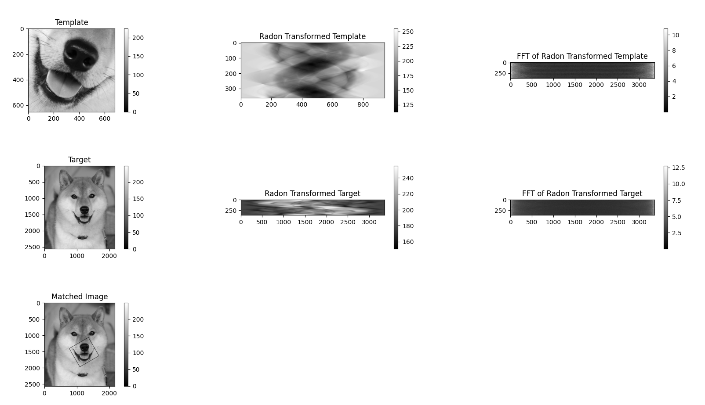

# radon-template-matching


## Abstruct
Template matching for rotation using Radon transforms.

## How to Use

### Python
```
pip install -r requirements.txt
python radon_template_matching.py
```

### C++
```
mkdir build && cd build
cmake -DCMAKE_BUILD_TYPE=Release ..
make
./RadonTemplateMatching
```

## References
Roberto Vasarri - Own work by the contributor, Public domain, by https://commons.wikimedia.org/w/index.php?curid=5788123

## 概要
ラドン変換を利用した回転にも対応できるテンプレートマッチング

## 使い方

### Python
```
pip install -r requirements.txt
python radon_template_matching.py
```

### C++
```
mkdir build && cd build
cmake -DCMAKE_BUILD_TYPE=Release ..
make
./RadonTemplateMatching
```

## 参照
Roberto Vasarri - 投稿者自身による著作物, パブリック・ドメイン, https://commons.wikimedia.org/w/index.php?curid=5788123 による
